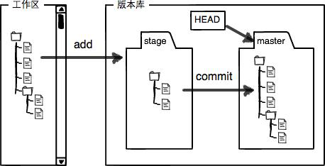

# 廖雪峰Git教程

Git is a distributed version control system.
Git is free software.

## 创建版本库

- 初始化Git仓库，用 git init 命令。
- 添加文件到Git仓库
    1. git add file1.txt file2.txt，追踪文件。 <!-- 没有stage？ -->
    1. git commit 提交变更。

## 时光机穿梭

- git status 查看工作区状态。
- git diff 查看更改内容。

### 版本回退 rollback

- git reset --hard HEAD^ 回退到上一个版本
- git reset --hard HEAD~n 回退到前n个版本
- git reset --hard `commit_id` 回到指定id的版本
- git log 查看<b>当前版本之前</b>的提交历史，以便确定要回退到哪个版本
- git reflog 查看命令历史，可以看到所有提交版本的记录

### 工作区和暂存区

- 工作区：workspace, working directory
- 暂存区：stage
- 版本库：repository



<!-- @import "workspace_repository.png" -->

@import "git_add.png"

@import "git_commit.png"

- git add 命令实际上是把要提交的所有更改放到暂存区——stage。
- git commit 则把暂存区的内容全部提交到`分支`

### 管理更改

- Git 管理和跟踪的是"更改"，而不是文件本身。没有跟踪(staged)的更改，版本库不会将其记录在内。
- 没有 `git add` 到 stage 的更改不会被加入到 `commit`中。

Git 保存的不是文件的变化或者差异，而是一系列不同时刻的文件快照。[^1]

[^1]: https://git-scm.com/book/zh/v2/Git-%E5%88%86%E6%94%AF-%E5%88%86%E6%94%AF%E7%AE%80%E4%BB%8B

### 撤销更改

1. 撤销工作区某个文件被更改但没有stage的内容：git checkout -- file.txt
1. 撤销已经stage的更改：
    1. git reset HEAD file.txt
    1. git checkout -- file.txt

### 删除文件

- 从版本库中删除文件
  1. git rm file.txt
  1. git commit <!-- 删除后要提交 -->
- 从版本库恢复工作区中被删除文件
  - git checkout -- file.txt

`git checkout`其实是用版本库里的版本替换工作区的版本，无论工作区是更改还是删除，都可以“一键还原”。

## 远程仓库

[ Github帮助文档 ](https://help.github.com/categories/managing-remotes/) [^2]

[^2]:https://help.github.com/categories/managing-remotes/

### GitHub授权

1. ssh-keygen -t rsa -b 4096 -C "your_email@example.com"
1. Adding a new SSH key to your GitHub account

### 添加远程仓库

#### 关联远程仓库

To add a new remote, use the `git remote add` command on the terminal, in the directory your repository is stored at.

The git remote add command takes two arguments:

- A remote name, for example, `origin`
- A remote URL, for example, `https://github.com/user/repo.git`
- A remote SSH, for exampel, `git@github.com:user/repo.git`

for example:

```powershell
git remote add origin https://github.com/user/repo.git
# Set a new remote with https
git remote add origin git@server-name:path/repo-name.git
# Set a new remote with SSH
git remote -v
# Verify new remote
```

### 推送版本库

关联之后，使用命令`git push -u origin master` 第一次推送master分支的所有内容；此后，用`git push origin master` 推送最新更改。

Pushing to a remote

Use git push to push commits made on your local branch to a remote repository.

The git push command takes two arguments:

- A remote name, for example, `origin`
- A branch name, for example, `master`

For example:

```powershell
git push  <REMOTENAME> <BRANCHNAME>
```

### 从远程仓库克隆

To grab a complete copy of another user's repository, use git clone like this:

```powershell
git clone https://github.com/USERNAME/REPOSITORY.git
```

## 分支管理
