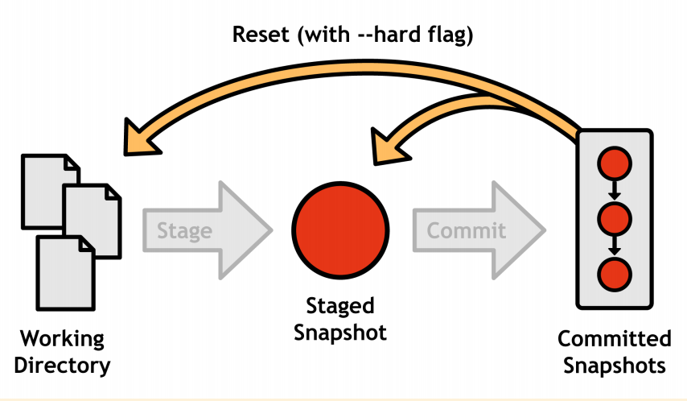
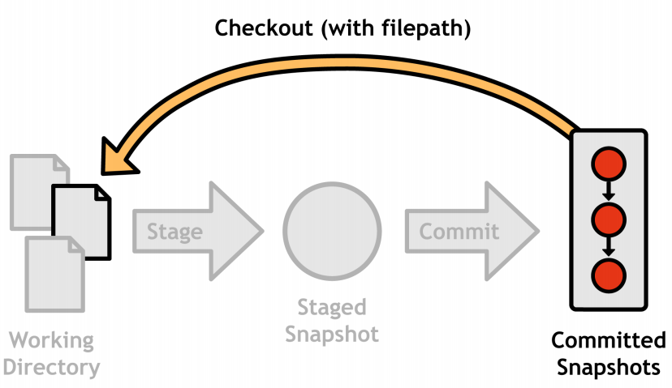
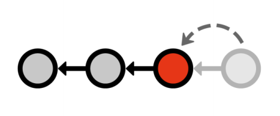
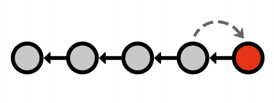
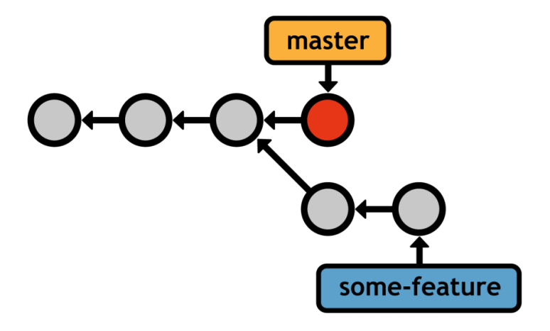
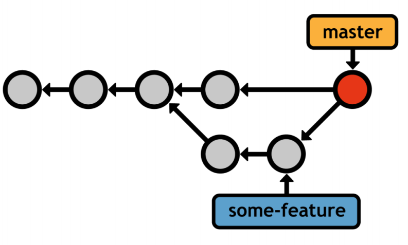

# 廖雪峰Git教程

Git is a distributed version control system.
Git is free software.

## 创建版本库

- 初始化Git仓库，用 `git init` 命令。
- 添加文件到Git仓库
    1. `git add file1.txt file2.txt`，追踪文件。 <!-- 没有stage？ -->
    1. `git commit` 提交变更。
    1. Commit message format:
        ```powershell
        <commit summary in 50 characters or less.>
        <blank line>
        <detailed description of changes in this commit.>
        ```

## 时光机穿梭

- `git status` 查看工作区状态。
- `git diff 查看unstaged`的更改内容。
- `git diff –cached` 查看staged更改内容。

### 版本回退 rollback {#rollback}

- `git reset --hard HEAD^` 回退到上一个版本
- `git reset --hard HEAD~n` 回退到前n个版本[⬇](#reset)
- `git reset --hard commit_id` 回到指定id的版本
- `git log` 查看<b>当前版本之前</b>的提交历史，以便确定要回退到哪个版本
- `git reflog` 查看命令历史，可以看到所有提交版本的记录

### 工作区和暂存区

- 工作区：workspace, working directory
- 暂存区：stage
- 版本库：repository


@import "git_add.png"

@import "git_commit.png"

- `git add` 命令实际上是把要提交的所有更改放到暂存区——stage。
- `git commit` 则把暂存区的内容全部提交到<b>分支</b>

To delete a file from a project, you need to add it to the staging area just like a new or modified file. The next command will stage the deletion and stop tracking the file, but it won’t delete the file from the working directory:

```powershell
git rm --cached <file>
```

A natural grouping of commands:
- Stage/Working Directory:
  - `git add`
  - `git rm`
  - `git status`
- Committed History:
  - `git commit`,
  - `git log`

To delete a file from a project, you need to add it to the staging area just like a new or modified file. The next command will stage the deletion and stop tracking the file, but it won’t delete the file from the working directory:

```powershell
git rm --cached <file>
```

A natural grouping of commands:
- Stage/Working Directory: git add, git rm, git status
- Committed History: git commit, git log

### 管理更改

- "为什么Git比其他版本控制系统设计得优秀，因为Git跟踪并管理的是修改，而非文件。"
- 没有 `git add` 到 stage 的更改不会被 `commit`到版本库中。

Git 保存的不是文件的变化或者差异，而是一系列不同时刻的文件快照。[^1]

[^1]: https://git-scm.com/book/zh/v2/Git-%E5%88%86%E6%94%AF-%E5%88%86%E6%94%AF%E7%AE%80%E4%BB%8B

#### 撤销更改

##### 撤销工作区某个文件被更改的内容

use `git checkout -- <file>...` to <b>discard changes</b> in working directory

:`git checkout -- <file>`命令中的`--`很重要，没有`--`，就变成了“切换到另一个分支”的命令。

如果`<file>`自修改后还没有被放到暂存区，现在，撤销修改就回到和版本库一样的状态；

如果`<file>`的更改已经添加到暂存区，之后又作了其它修改，现在，撤销修改就回到暂存区中的状态。

##### 撤销某个文件在暂存区中的更改

use `git reset HEAD <file>...` to unstage

`git reset`命令既可以回退版本，也可以把暂存区的修改回退到工作区：修改内容退回工作区，没有stage。

1. `git reset HEAD <file>`
1. `git checkout -- <file>`

#### 重置工作区和暂存区 {#reset}

```powershell
git reset --hard HEAD
```

将工作区和暂存区重置到最近一次提交版本。[⬆](#rollback)



#### 重置工作区的单个文件

```powershell
git checkout commit id <file>
```

版本库不受影响，仅仅是将工作区文件设置为某一个版本。



#### 重置单个文件的暂存区

```powershell
git reset HEAD <file>
```

Omitting the `--hard` flag tells Git to leave the working directory alone (opposed to git reset `–-hard HEAD`, which resets every file in both the working directory and the stage).

The staged version of the file matches HEAD, and the working directory retains the modified version.

As you might expect, this results in an unstaged modification in your git status output.

#### 撤销提交版本

    git reset HEAD~n

By moving the HEAD reference backward, you’re effectively removing the most recent commit from the project’s history.

向前移动 n 位 HEAD 指针位置，等效于删除了 n 位之后的版本(版本库中看不见了，实际文件快照还在)。



#### 恢复旧版本

    git revert <commit-id>

用旧版本作为下一个提交版本。



#### 版本修订

    git commit –amend

增加更改，并提交到最近一个版本。

### 删除文件

- 从版本库中删除文件
  1. `git rm <file>`
  1. `git commit` <!-- 删除后要提交 -->
- 从版本库恢复工作区中被删除文件
  - `git checkout -- <file>`

`git checkout`其实是用版本库里的版本替换工作区的版本，无论工作区是更改还是删除，都可以“一键还原”。

## 远程仓库

[ Github帮助文档 ](https://help.github.com/categories/managing-remotes/) [^2]

[^2]:https://help.github.com/categories/managing-remotes/

### GitHub授权

1. ssh-keygen -t rsa -b 4096 -C "your_email@example.com"
1. Adding a new SSH key to your GitHub account

### 添加远程仓库

#### 关联远程仓库

To add a new remote, use the `git remote add` command on the terminal, in the directory your repository is stored at.

The git remote add command takes two arguments:

- A remote name, for example, `origin`
- A remote URL, for example, `https://github.com/user/repo.git`
- A remote SSH, for exampel, `git@github.com:user/repo.git`

for example:

```powershell
git remote add origin https://github.com/user/repo.git
# Set a new remote with https
git remote add origin git@server-name:path/repo-name.git
# Set a new remote with SSH
git remote -v
# Verify new remote
```

### 推送版本库

关联之后，使用命令`git push -u origin master` 第一次推送master分支的所有内容；此后，用`git push origin master` 推送最新更改。

Pushing to a remote

Use git push to push commits made on your local branch to a remote repository.

The git push command takes two arguments:

- A remote name, for example, `origin`
- A branch name, for example, `master`

For example:

```powershell
git push  <REMOTENAME> <BRANCHNAME>
```

### 从远程仓库克隆

To grab a complete copy of another user's repository, use git clone like this:

```powershell
git clone https://github.com/USERNAME/REPOSITORY.git
```

## 分支管理

- Listing branches

        git branch

- Creating branches

        git branch <name>

- Deleting branches

        git branch -d <name>

### Checking out branches

    git checkout <branch>

    git checkout -b <new-branch-name>

This is a shortcut for `git branch <new-branch-name>` followed by `git checkout <new-branch-name>`.

### Merging branches

The branch you want to merge into must be checked out, and the target branch will remain unchanged.

    git checkout master
    git merge some-feature

this merges the some-feature branch into the master branch, leaving the former untouched.

#### Fast-forward merges

dev分支版本迭代，master分支保持dev时的状态。

#### 3-way merges

master分支和dev分支都发生了版本迭代。

This started out like a fast-forward merge, but we added a commit to the master branch while we were still developing some-feature，so we wind up in the scenario shown below:



Git generates a new merge commit that represents the combined snapshot of both branches. Note that this new commit has two parent commits, giving it access to both histories (indeed, running git log after the 3- way merge shows commits from both branches).



### Merge conflicts

If you try to combine two branches that make different changes to the same portion of code, Git won’t know which version to use. This is called a merge conflict.

Every file with a conflict is stored under the “Unmerged paths” section.

### Rebasing

### 推送分支

    git push origin dev

### 抓取分支

- 抓取远程分支到本地新建的分支

        git checkout -b <local-branch> <remote-branch>

- 指定本地分支与远程分支的链接。

        git branch --set-upstream <local-branch> <remote-branch>

### 多人协作

多人协作的工作模式通常是这样：

首先，可以试图用`git push origin branch-name`推送自己的修改；

如果推送失败，则因为远程分支比你的本地更新，需要先用`git pul`l试图合并；

如果合并有冲突，则解决冲突，并在本地提交；

没有冲突或者解决掉冲突后，再用`git push origin branch-name`推送就能成功！

如果`git pull`提示“no tracking information”，则说明本地分支和远程分支的链接关系没有创建，用命令`git branch --set-upstream branch-name origin/branch-name`。